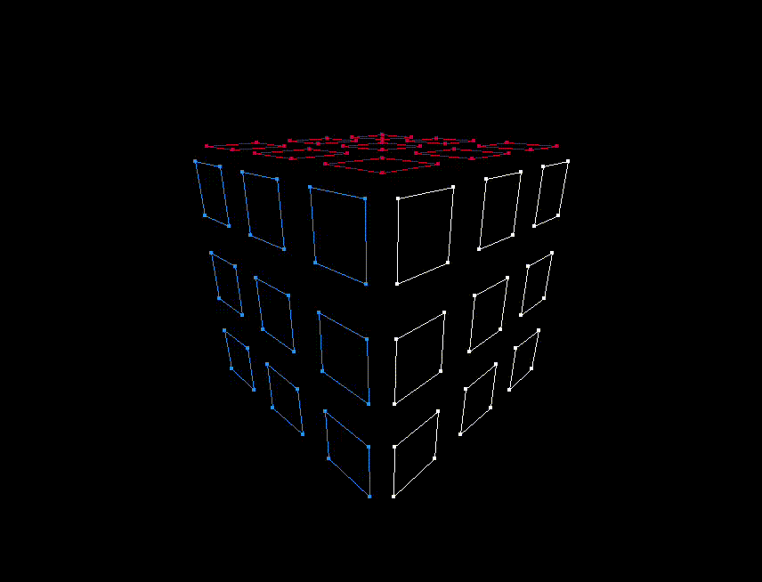

### 3D Rubik's Cube 


A C++ based 3D Rubik's Cube simulation built from scratch. 
It uses its own 3d rendering pipline(camera basis, coordinate transformations) and sdl2 for low-level drawing.

###  Keys

It follows standard cubing notations:


| Keys   | Action    |
|--------------- | --------------- |
| f, b, u, d, l, r|         rotating the faces clockwise|
| shift + f, b, u, d, l, r| rotating the faces anticlockwise|
| s|                        scramble|
| r|                        reset/solve|
| arrow up/down|            rotate camera vertically ($\phi$)|
| arrow left/right|         rotate camera horizontally ($\theta$)|
| = / - (equals/minus)|     zoom out/in ($\rho$)|
| q|                        quit|

### Implementation details

Unlike standard engines, I calculated the pixel coordinates for the cube vertices manually.
- The cube stores an vector of size 54 with the colors for each cell.
- It also stores a vector of 54 facelets defined in 3D $(x, y, z)$ space. 
- Each facelet stores the position and normal vector for a cell.
- The camera has a 3 basis vectors - forward, right, up.
- Dot product of the basis vectors with the normal vectors of each facelet deciding which facelets to render.

###  File Structure

* `main.cpp`       : SDL event loop and input processing.
* `cube.cpp/h`     : cube state, facelet generation, and rotation logic.
* `camera.cpp/h`   : spherical coordinates for the camera and basis vector calculations.
* `geometry.cpp/h` : helpers for math operations (dot products, vector rotations).
* `constants.h`    : stores screen dimensions, colors, etc.

###  Running

1.  **Compile the project:**
    ```bash
    make rubix
    ```

2.  **Run the executable:**
    ```bash
    ./rubix
    ```

3.  Delete the executables:
    ```bash
    make clean
    ```

